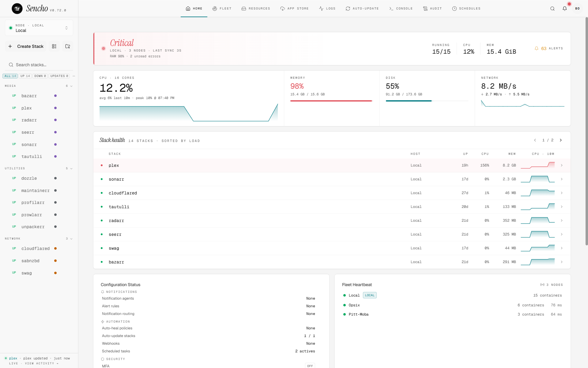
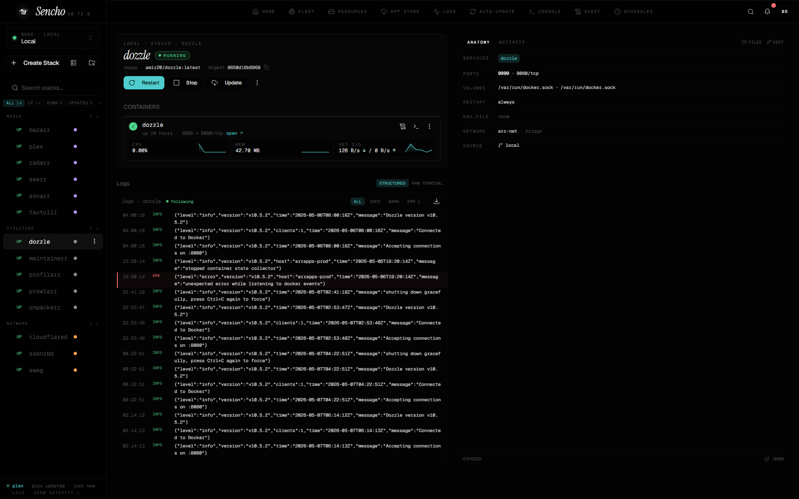
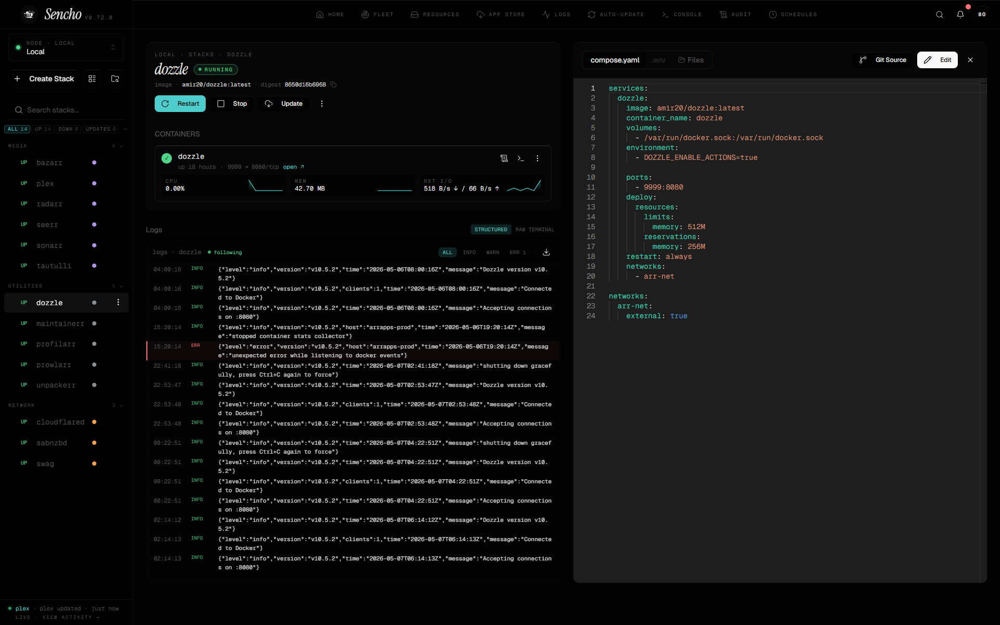
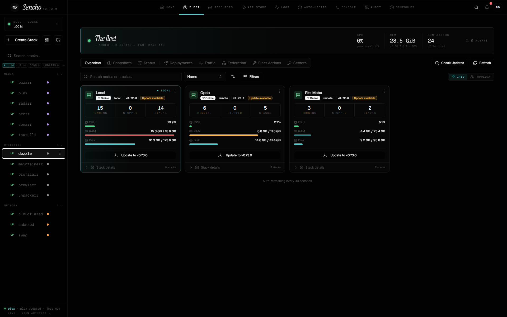
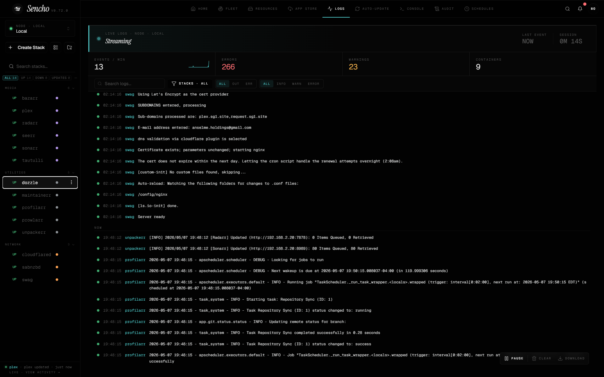

<div align="center">
  <picture>
    <source media="(prefers-color-scheme: dark)" srcset="frontend/public/sencho-logo-dark.png">
    
  </picture>

  ### Self-hosted Docker Compose management for one machine or a fleet.

  <p>
    <a href="https://docs.sencho.io">Docs</a> ·
    <a href="https://sencho.io">Website</a> ·
    <a href="https://github.com/studio-saelix/sencho/discussions">Discussions</a> ·
    <a href="https://buymeacoffee.com/sencho">Sponsor</a>
  </p>

  [](https://github.com/studio-saelix/sencho/releases)
  [](https://hub.docker.com/r/saelix/sencho)
  [](https://github.com/studio-saelix/sencho/actions/workflows/ci.yml)
  [](LICENSE)
  [](https://github.com/studio-saelix/sencho/discussions)
</div>

<br />

<picture>
  <source media="(prefers-color-scheme: dark)" srcset="docs/images/dashboard-dark.png">
  
</picture>

> [!NOTE]
> Sencho is currently in public beta on the path to v1.0. Core workflows are actively tested, but early users should review the known limitations and avoid deploying it blindly on critical infrastructure without testing in their own environment first.

---

## What Sencho is

Sencho is for homelab operators, small DevOps teams, and platform engineers who run services on Docker Compose, want a graphical interface without giving up file-on-disk workflows, and need to manage more than one machine without SSH gymnastics or a VPN.

It runs as a single container on your hardware and gives you a UI for the work you currently do over SSH on compose stacks: deploying, editing files, watching logs, restarting containers, browsing volumes, and recovering from failures. Your compose files stay on the host filesystem and remain the source of truth.

A Sencho instance is autonomous. To manage another machine, you install a second Sencho on it and connect them with a long-lived API token; the primary dashboard then acts as an authenticated HTTP and WebSocket proxy across your fleet. Use TLS, a VPN, or a private network for any untrusted link. Each node still uses its local Docker socket (see Quick start), but Sencho does not require SSH and does not expose a remote Docker socket on the network. For nodes behind NAT or strict firewalls, the Pilot Agent establishes a single outbound WebSocket tunnel to the primary, so the remote host opens no inbound port at all.

Most capabilities are free in the Community tier. A few advanced automation and fleet-control features ship in paid tiers; pricing lives at [sencho.io/pricing](https://sencho.io/pricing).

## What Sencho is not (yet)

Sencho is a Docker Compose control plane focused on homelab and small-fleet operators. It is intentionally not:

- A Kubernetes scheduler or replacement.
- A reverse proxy. Front Sencho with your existing proxy (Caddy, Traefik, nginx) for TLS and authentication on the public edge.
- A monitoring stack. Sencho surfaces container and host metrics in the dashboard but does not replace Prometheus, Grafana, or your existing alerting pipeline.
- A CI / CD pipeline. Use webhooks, the API, or Git-sourced stacks to connect Sencho to your build system.

See [KNOWN_LIMITATIONS.md](KNOWN_LIMITATIONS.md) for the current limitation list.

---

**Tier coverage:** All bullets below are available in the free Community tier unless marked with `(Skipper)` for paid mid-tier or `(Admiral)` for paid top-tier. Full breakdown at [sencho.io/pricing](https://sencho.io/pricing).

## Capabilities

### Stacks
- Full Compose lifecycle: create, deploy, restart, stop, pull
- Monaco editor with diff preview before save and one-click rollback
- [Git-sourced stacks](https://docs.sencho.io/features/git-sources) pulled and synced from any repository
- File explorer for compose, env, and supporting files
- [Stack labels](https://docs.sencho.io/features/stack-labels) for grouping and bulk operations
- [App Store](https://docs.sencho.io/features/app-store) with LinuxServer.io templates

### Observability
- Aggregated [log search and stream](https://docs.sencho.io/features/global-observability) across every container in the fleet
- Live container stats, health checks, and image-update notifications
- Threshold alerts for CPU, memory, and network
- Read-only [audit log](https://docs.sencho.io/features/audit-log) of every action **(Admiral)**
- [Network topology](https://docs.sencho.io/features/fleet-view) view of containers, networks, and nodes

### Fleet
- Multi-node management via authenticated HTTP and WebSocket proxy
- [Fleet view](https://docs.sencho.io/features/fleet-view) with grid and topology layouts
- [Fleet snapshots](https://docs.sencho.io/features/fleet-backups) of compose and env across the fleet
- [Pilot Agent](https://docs.sencho.io/features/pilot-agent) for nodes behind NAT or strict firewalls
- Node compatibility checks before deploying

### Automation
- [Auto-heal policies](https://docs.sencho.io/features/auto-heal-policies) for failed containers **(Skipper)**
- [Auto-update policies](https://docs.sencho.io/features/auto-update-policies) for image rollouts **(Skipper)**
- [Scheduled operations](https://docs.sencho.io/features/scheduled-operations) on cron **(Skipper)**
- [Blueprints](https://docs.sencho.io/features/blueprint-model): declarative fleet templates with drift detection **(Skipper)**
- [Webhooks](https://docs.sencho.io/features/webhooks) on stack lifecycle events **(Skipper)**
- Encrypted [Fleet Secrets](https://docs.sencho.io/features/fleet-secrets) pushed to labeled nodes **(Skipper)**

### Security
- [SSO](https://docs.sencho.io/features/sso): custom OIDC, presets for Google, GitHub, and Okta, plus LDAP and Active Directory
- [Two-factor authentication](https://docs.sencho.io/features/two-factor-authentication) with TOTP and backup codes
- [RBAC](https://docs.sencho.io/features/rbac) with five roles: admin (full control), viewer (read-only), deployer (deploy and restart, no edits), node-admin (admin scoped to specific nodes), and auditor (read-only with audit-log access)
- [Vulnerability scanning](https://docs.sencho.io/features/vulnerability-scanning) via Trivy on every tier with VEX-based suppression; SARIF export and SBOM upload **(Skipper)**
- [Private registries](https://docs.sencho.io/features/private-registries) **(Admiral)** and [deploy enforcement](https://docs.sencho.io/features/deploy-enforcement) **(Skipper)** for non-compliant images
- [API tokens](https://docs.sencho.io/features/api-tokens) for automation

### Operations
- [Host console](https://docs.sencho.io/features/host-console) in the browser **(Admiral)**
- Off-site stack archives via custom S3 (every tier) or [Sencho Cloud Backup](https://docs.sencho.io/operations/backup) **(Admiral)** for managed storage
- [Notification routing](https://docs.sencho.io/features/alerts-notifications#notification-routing) to Slack, Discord, email, and webhooks
- [Global search](https://docs.sencho.io/features/global-search) across stacks, containers, and services
- [Resources view](https://docs.sencho.io/features/resources) for images, volumes, and networks with scoped prune actions

---

### Before you install

Sencho talks to Docker through the host's `/var/run/docker.sock`. Mounting this socket grants Sencho the same privilege as `sudo docker` on the host. This is the same model used by Portainer, Dockge, Komodo, and other Compose dashboards. If your threat model requires stricter isolation, see [running with a non-root container user](https://docs.sencho.io/operations/self-hosting#non-root-user) and front Sencho with a reverse proxy that enforces authentication.

## Quick start

Sencho runs in a single container.

```yaml
services:
  sencho:
    image: saelix/sencho:latest
    container_name: sencho
    restart: unless-stopped
    ports:
      - "1852:1852"
    volumes:
      - /var/run/docker.sock:/var/run/docker.sock
      - ./data:/app/data
      # 1:1 Compose Path Rule: the host path MUST match the container path
      - /opt/docker:/opt/docker
    environment:
      - COMPOSE_DIR=/opt/docker
      - DATA_DIR=/app/data
```

```bash
docker compose up -d
```

Open `http://your-server:1852` and create your admin account.

Always front Sencho with a TLS-terminating reverse proxy in production. See the [self-hosting guide](https://docs.sencho.io/operations/self-hosting) for hardening, environment variables, and reverse-proxy examples.

<details>
<summary>Run with <code>docker run</code> instead</summary>

```bash
docker run -d --name sencho \
  -p 1852:1852 \
  -v /var/run/docker.sock:/var/run/docker.sock \
  -v sencho_data:/app/data \
  # 1:1 Compose Path Rule: the host path MUST match the container path
  -v /opt/docker:/opt/docker \
  -e COMPOSE_DIR=/opt/docker \
  saelix/sencho:latest
```

</details>

For the full walkthrough, see the [quickstart guide](https://docs.sencho.io/getting-started/quickstart).

---

## Adding remote nodes

To manage a second machine, install Sencho on it the same way, then add it from the primary dashboard with its URL and a long-lived API token. The primary proxies authenticated HTTP and WebSocket requests to the remote instance. The remote node does not run SSH for Sencho, does not expose its Docker socket on the network, and does not run a separate agent process. The local Sencho on each node manages its own Docker through the standard socket mount described in Quick start. Nodes behind NAT or strict firewalls can opt into the Pilot Agent for outbound-only connectivity.

See the [multi-node guide](https://docs.sencho.io/features/multi-node) for the full token-bearer flow.

---

## Screenshots

| | |
|---|---|
|  |  |
|  |  |

---

## Telemetry and data handling

Sencho does not emit telemetry, analytics, or crash reports. The only outbound traffic is license validation against Lemon Squeezy, and only when a paid license key is activated. Community-tier instances make no outbound calls to Sencho-controlled endpoints. Stack metadata, container inventory, and user activity never leave your instance.

---

## Documentation, community, and license

- **Documentation:** [docs.sencho.io](https://docs.sencho.io)
- **If something breaks:** the [Recovery guide](https://docs.sencho.io/operations/recovery) covers getting back to a working state when Sencho, a deploy, sign-in, Docker, or a node fails.
- **Community:** [GitHub Discussions](https://github.com/studio-saelix/sencho/discussions)
- **Contributing:** [CONTRIBUTING.md](CONTRIBUTING.md)
- **Security:** [SECURITY.md](SECURITY.md). Do not open public issues for security vulnerabilities.
- **License:** [Business Source License 1.1](LICENSE). Free for most self-hosted production use under the BSL Additional Use Grant; see [LICENSE](LICENSE) and the [license FAQ](https://sencho.io/license-faq) for exact terms. Converts to [Apache 2.0](https://www.apache.org/licenses/LICENSE-2.0) on **2030-03-25**.

---

<div align="center">

[](https://github.com/studio-saelix/sencho/graphs/contributors)

</div>
