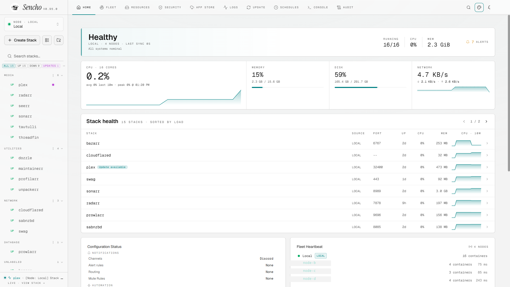
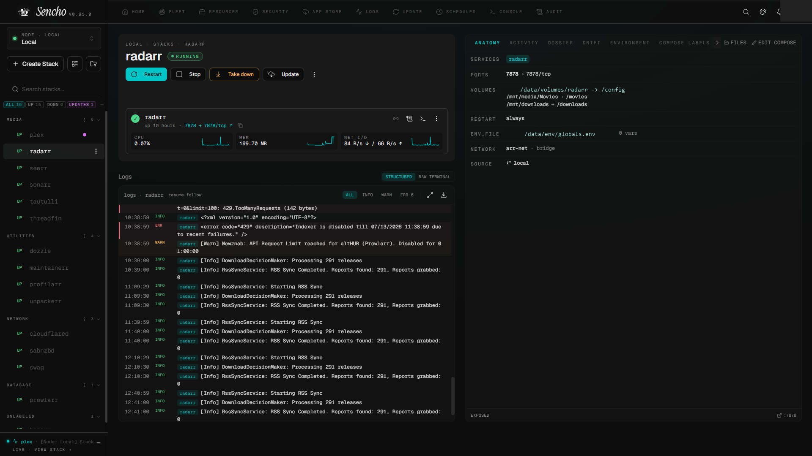
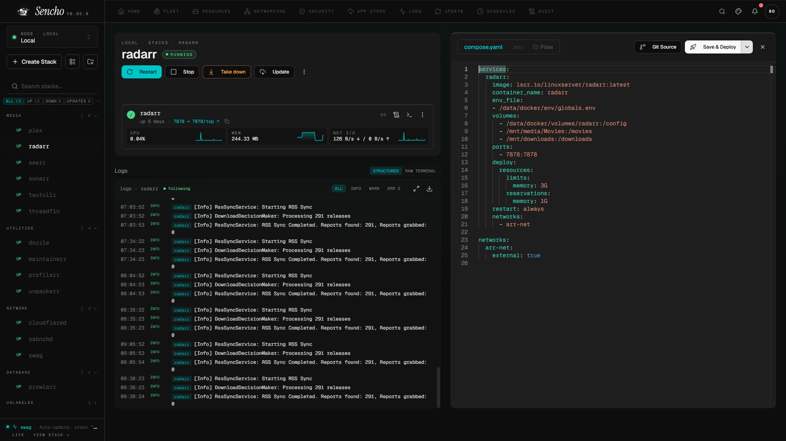
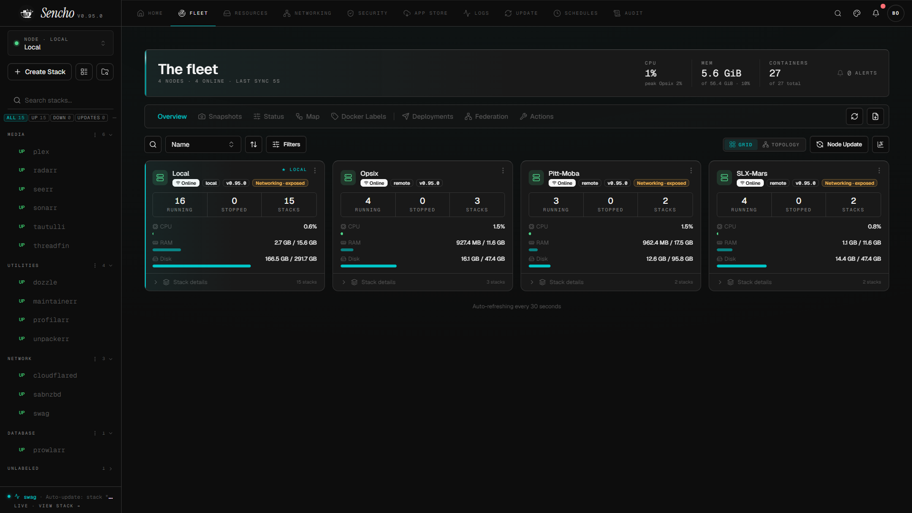
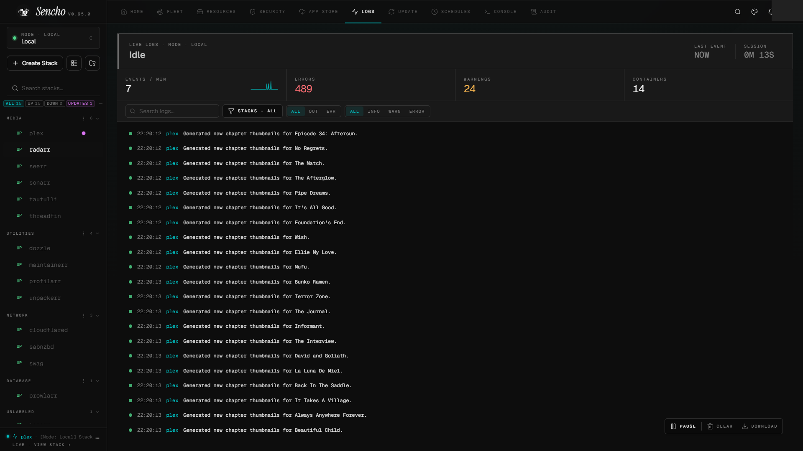
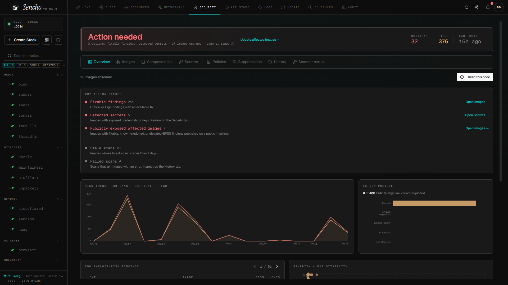
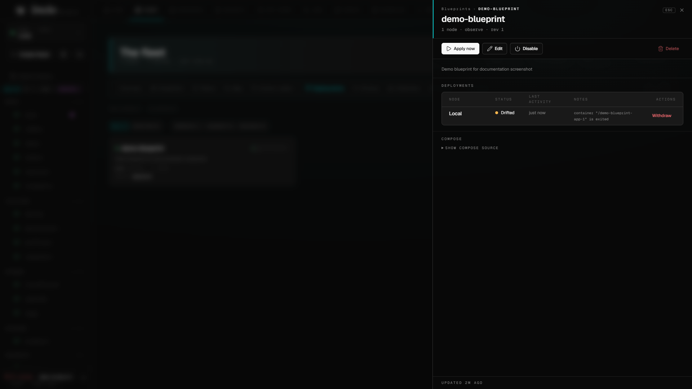
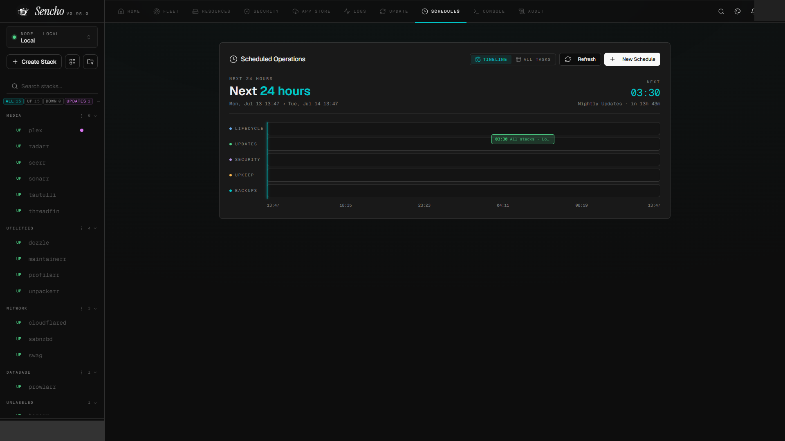
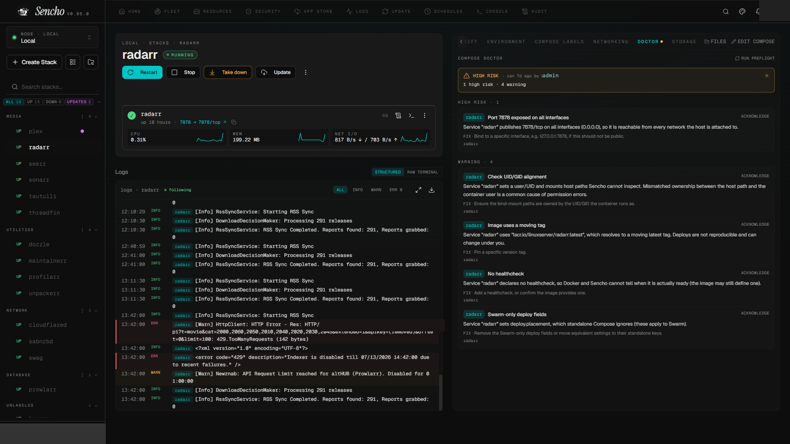

<div align="center">
  <picture>
    <source media="(prefers-color-scheme: dark)" srcset="frontend/public/sencho-logo-dark.svg">
    
  </picture>

  ### Self-hosted Docker Compose management for one machine or a fleet.

  <p>
    <a href="https://docs.sencho.io">Docs</a> ·
    <a href="https://sencho.io">Website</a> ·
    <a href="https://github.com/studio-saelix/sencho/discussions">Discussions</a> ·
    <a href="https://github.com/sponsors/Studio-Saelix">Sponsor</a> ·
    <a href="https://buymeacoffee.com/sencho">Buy Me a Coffee</a>
  </p>

  [](https://github.com/studio-saelix/sencho/releases)
  [](https://hub.docker.com/r/saelix/sencho)
  [](https://github.com/studio-saelix/sencho/actions/workflows/ci.yml)
  [](https://github.com/studio-saelix/sencho/actions/workflows/codeql.yml)
  [](LICENSE)
  [](https://github.com/studio-saelix/sencho/commits/main)
  [](https://github.com/studio-saelix/sencho/issues)
  [](https://sencho.io)
  [](https://docs.sencho.io)
</div>

<br />

<picture>
  <source media="(prefers-color-scheme: dark)" srcset="docs/images/dashboard-dark.png">
  
</picture>

> [!NOTE]
> Sencho is used in production for day-to-day Docker Compose and fleet management. As a pre-1.0 project it still evolves quickly, so review the known limitations and validate against your own setup before deploying it on critical infrastructure.

---

## What Sencho is

Sencho is a Docker Compose control plane for DevOps engineers, platform teams, system administrators and homelab users who run services on Compose and need a real operational surface: a graphical interface that does not give up file-on-disk workflows, and the ability to manage more than one machine without SSH gymnastics or a VPN.

It runs as a single container on your hardware and provides a UI for common Compose operations: deploying, editing files, watching logs, restarting containers, browsing volumes, and recovering from failures. Your compose files stay on the host filesystem and remain the source of truth.

Multi-node was part of the architecture from the start, not bolted on later: every Sencho instance is the same autonomous node, whether it runs alone or as one of many in a fleet. To manage another machine, you install a second Sencho on it and connect them with a long-lived API token; the primary dashboard then acts as an authenticated HTTP and WebSocket proxy across your fleet. Use TLS, a VPN, or a private network for any untrusted link. Each node still uses its local Docker socket (see Quick start), but Sencho does not require SSH and does not expose a remote Docker socket on the network. For nodes behind NAT or strict firewalls, the Pilot Agent establishes a single outbound WebSocket tunnel to the primary, so the remote host opens no inbound port at all.

Sencho is free, open-source software under AGPLv3. Everything below is included in the Community tier with unlimited nodes and users.

---

## Capabilities

### Stacks
- Full Compose lifecycle: create, deploy, restart, stop, take down, pull
- Atomic deployments with automatic rollback on failure
- Monaco editor with diff preview before save and one-click rollback to any prior deploy
- [Health-gated updates](https://docs.sencho.io/features/health-gated-updates) that hold a rollout until health checks pass, with stalled-update detection and in-app recovery
- [Git-sourced stacks](https://docs.sencho.io/features/git-sources) pulled and synced from any repository, with ordered multi-file Compose
- [File explorer](https://docs.sencho.io/features/stack-file-explorer) for compose, env, and supporting files, with move and rename across directories
- [Drift detection](https://docs.sencho.io/features/stack-drift) that compares running containers against the effective Compose model and flags exactly what changed
- [Environment and secrets guardrails](https://docs.sencho.io/features/environment-guardrails) that inventory every variable a stack uses and flag missing or duplicate values, without ever exposing a value
- [Storage portability](https://docs.sencho.io/features/compose-storage) checks that show whether a stack's mounts can move cleanly to another node before you move it
- [Compose Doctor](https://docs.sencho.io/features/compose-doctor) preflight checks that catch compose problems before deploy
- [Stack labels](https://docs.sencho.io/features/stack-labels) for grouping and bulk operations
- [App Store](https://docs.sencho.io/features/app-store) with LinuxServer.io templates by default, or any custom Portainer-compatible registry

### Observability
- Aggregated [log search and stream](https://docs.sencho.io/features/global-observability) across every container in the fleet
- Live container stats, health checks, and image-update notifications on a configurable cadence, with links from each image to its registry and source
- Threshold alerts for CPU, memory, and network
- Read-only [audit log](https://docs.sencho.io/features/audit-log) of every action, with a 14-day recent-activity window
- [Network topology](https://docs.sencho.io/features/fleet-view) view of containers, networks, and nodes
- Documentation-drift flags when a [stack dossier](https://docs.sencho.io/features/stack-dossier) diverges from the running stack

### Fleet
- Multi-node management via authenticated HTTP and WebSocket proxy
- [Fleet view](https://docs.sencho.io/features/fleet-view) with grid and topology layouts
- [Fleet snapshots](https://docs.sencho.io/features/fleet-backups) of compose and env across the fleet
- [Fleet Federation](https://docs.sencho.io/features/fleet-federation): cordon nodes and pin Blueprints to specific hosts
- [Fleet Actions](https://docs.sencho.io/features/fleet-actions): bulk label operations, fleet-wide stop-by-label, and fleet-wide prune
- [Fleet Dossier](https://docs.sencho.io/features/fleet-dossier): export the whole fleet as a single browsable Markdown archive
- [Docker Label Audit](https://docs.sencho.io/features/docker-label-audit) across every node, for labels that drive external automation
- [Remote updates](https://docs.sencho.io/features/remote-updates): pull the latest image and recreate any node in the fleet from the Fleet view, no SSH session required
- Node labels and grouping
- [Pilot Agent](https://docs.sencho.io/features/pilot-agent) for nodes behind NAT or strict firewalls
- Node compatibility checks before deploying

### Automation
- [Auto-heal policies](https://docs.sencho.io/features/auto-heal-policies) for failed containers
- [Auto-update policies](https://docs.sencho.io/features/auto-update-policies) for image rollouts
- [Scheduled operations](https://docs.sencho.io/features/scheduled-operations) on cron
- [Webhooks](https://docs.sencho.io/features/webhooks) on stack lifecycle events
- [Blueprints](https://docs.sencho.io/features/blueprint-model): declarative fleet templates with drift detection

### Security
- [SSO](https://docs.sencho.io/features/sso): custom OIDC and presets for Google, GitHub, and Okta
- [Two-factor authentication](https://docs.sencho.io/features/two-factor-authentication) with TOTP and backup codes
- [RBAC](https://docs.sencho.io/features/rbac) with five built-in roles and stack or node scoped assignments
- [Security overview](https://docs.sencho.io/features/security) with a chart-led scan summary, sortable images, and searchable scan history
- [Vulnerability scanning](https://docs.sencho.io/features/vulnerability-scanning) via Trivy, with on-demand node-wide scans, VEX-based suppression, SARIF export, and SBOM upload
- [Compose network inspector](https://docs.sencho.io/features/compose-networking) with an exposure-intent guard for unintended published ports
- Node-wide network inventory, topology, and exposure findings across every stack on a node
- [Scan policies](https://docs.sencho.io/features/vulnerability-scanning#scan-policies) that set severity thresholds and can block a deploy
- [Private registries](https://docs.sencho.io/features/private-registries) for Docker Hub, GHCR, and custom registries, plus [deploy enforcement](https://docs.sencho.io/features/deploy-enforcement) for non-compliant images
- [API tokens](https://docs.sencho.io/features/api-tokens) for automation

### Operations
- Off-site stack archives via [custom S3-compatible storage](https://docs.sencho.io/operations/backup)
- [Notification routing](https://docs.sencho.io/features/alerts-notifications#notification-routing) to Slack, Discord, and any generic webhook
- [Global search](https://docs.sencho.io/features/global-search) across pages, nodes, and every stack in the fleet
- [Resources view](https://docs.sencho.io/features/resources) for images, volumes, and networks with scoped prune actions

---

### Before you install

Sencho talks to Docker through the host's `/var/run/docker.sock`. Mounting this socket grants Sencho the same privilege as `sudo docker` on the host. This is the same model used by Portainer, Dockge, Komodo, and other Compose dashboards. If your threat model requires stricter isolation, see [running with a non-root container user](https://docs.sencho.io/getting-started/configuration#container-user) and front Sencho with a reverse proxy that enforces authentication.

## Quick start

Sencho runs in a single container.

```yaml
services:
  sencho:
    image: saelix/sencho:latest
    container_name: sencho
    restart: unless-stopped
    ports:
      - "1852:1852"
    volumes:
      - /var/run/docker.sock:/var/run/docker.sock
      - ./data:/app/data
      # 1:1 Compose Path Rule: the host path MUST match the container path
      - /opt/docker:/opt/docker
    environment:
      - COMPOSE_DIR=/opt/docker
      - DATA_DIR=/app/data
```

```bash
docker compose up -d
```

Open `http://your-server:1852` and create your admin account.

Always front Sencho with a TLS-terminating reverse proxy in production. See the [self-hosting guide](https://docs.sencho.io/operations/self-hosting) for hardening, environment variables, and reverse-proxy examples.

<details>
<summary>Run with <code>docker run</code> instead</summary>

```bash
docker run -d --name sencho \
  -p 1852:1852 \
  -v /var/run/docker.sock:/var/run/docker.sock \
  -v sencho_data:/app/data \
  # 1:1 Compose Path Rule: the host path MUST match the container path
  -v /opt/docker:/opt/docker \
  -e COMPOSE_DIR=/opt/docker \
  saelix/sencho:latest
```

</details>

For the full walkthrough, see the [quickstart guide](https://docs.sencho.io/getting-started/quickstart).

---

## Adding remote nodes

To manage a second machine, install Sencho on it the same way, then add it from the primary dashboard with its URL and a long-lived API token. The primary proxies authenticated HTTP and WebSocket requests to the remote instance. The remote node does not run SSH for Sencho, does not expose its Docker socket on the network, and does not run a separate agent process. The local Sencho on each node manages its own Docker through the standard socket mount described in Quick start. Nodes behind NAT or strict firewalls can opt into the Pilot Agent for outbound-only connectivity.

See the [multi-node guide](https://docs.sencho.io/features/multi-node) for the full token-bearer flow.

---

## Screenshots

| | |
|---|---|
|  |  |
|  |  |
|  |  |
|  |  |

---

## Telemetry and data handling

Sencho does not emit telemetry, analytics, or crash reports, and makes no outbound calls to Sencho-controlled endpoints. Stack metadata, container inventory, and user activity never leave your instance.

---

## Admiral

**Admiral** is Studio Saelix's paid business assurance plan on top of everything in Community: Hardened Build, Recovery Vault (managed off-site snapshots), priority support, and governance depth (LDAP / Active Directory, full audit log export and anomaly detection, and related organizational controls). Built-in RBAC (five roles and scoped assignments) is included on Community. AWS ECR registry credentials currently require Admiral as well; that access rule is temporary availability, not the reason Admiral exists. See [sencho.io/pricing](https://sencho.io/pricing) for current plan details.

---

## Documentation, community, and license

- **Documentation:** [docs.sencho.io](https://docs.sencho.io)
- **Blog:** [sencho.io/blog](https://sencho.io/blog)
- **Known limitations:** [KNOWN_LIMITATIONS.md](KNOWN_LIMITATIONS.md)
- **If something breaks:** the [Recovery guide](https://docs.sencho.io/operations/recovery) covers getting back to a working state when Sencho, a deploy, sign-in, Docker, or a node fails.
- **Community:** [GitHub Discussions](https://github.com/studio-saelix/sencho/discussions)
- **Contributing:** [CONTRIBUTING.md](CONTRIBUTING.md)
- **Security:** [SECURITY.md](SECURITY.md). Do not open public issues for security vulnerabilities.
- **License:** [GNU Affero General Public License v3.0](LICENSE) (`AGPL-3.0-only`). Copyright (c) 2026 Studio Saelix. Sencho is free software; see [LICENSE](LICENSE) and [Licensing](https://docs.sencho.io/features/licensing) for terms. Studio Saelix trademarks are described in [TRADEMARKS.md](TRADEMARKS.md).

---

<div align="center">

[](https://github.com/studio-saelix/sencho/graphs/contributors)

</div>
